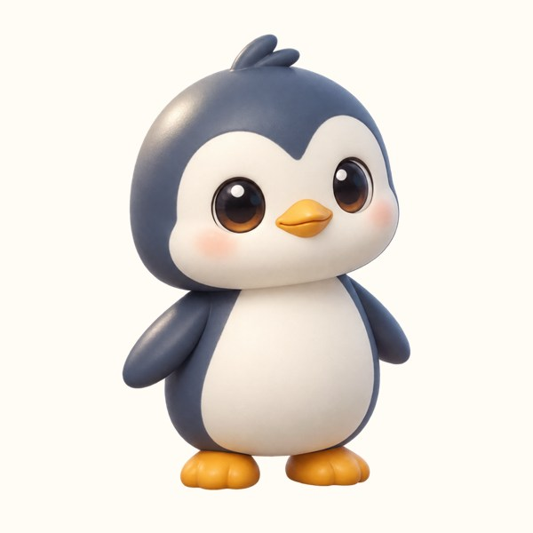

# 桌面宠物 DesktopPet

一个简洁、轻量、常驻 Windows 桌面的虚拟宠物程序。核心体验是"桌面陪伴感"——宠物像真的住在你的桌面上，而不是一个普通窗口。



- 技术栈：C# / .NET 10 / WPF
- 平台：仅 Windows（Windows 10 / 11）
- 存档：本地 JSON
- 无第三方运行时依赖（自包含发布）

## 功能

- **桌面角色**：一只企鹅，无边框、透明、无任务栏按钮、可置顶、可拖动，宠物以外区域鼠标穿透
- **自主行为**：根据时间、饥饿、心情、精力、随机概率自主选择待机 / 走动 / 张望 / 坐下 / 睡觉 / 整理羽毛 / 伸懒腰 / 扇翅膀等，不是固定时间轴循环
- **移动表现**：走动带步态（普通 / 小步快走 / 小跑 / 快速移动），转身、停下有过渡动画；待机时会眨眼
- **状态系统**：饱食度、心情、精力、健康，随时间自然变化，永不死亡
- **互动**：鼠标悬停宠物 → 头顶显示状态、右侧展开弧形菜单；喂食（小鱼干 / 鲜虾 / 牛奶）、摸摸、装扮、设置、隐藏
- **互动反应**：点击（被点击 / 惊讶）、抚摸（被摸 → 开心 / 害羞）、拖动（受惊）、启动（打招呼）等表情动画
- **装扮**：帽子 / 眼镜 / 围巾，本地选择即时生效
- **系统托盘**：显示隐藏、设置、重新定位、检查更新、退出
- **本地存档 + 离线结算**：关闭后按经过时间计算状态变化，封顶 72 小时
- **检查更新**：从 GitHub Releases 检查新版本，应用内通知提示

## 下载与安装

到 [Releases](https://github.com/lyhxx/pet-desktop/releases) 页面下载：

- `DesktopPet-Setup.exe` — 安装版（免管理员，带开始菜单 / 桌面快捷方式、卸载）
- `DesktopPet-win-x64.zip` — 免安装绿色版，解压后双击 `DesktopPet.exe`

## 运行（开发）

```bash
dotnet run
```

需要 .NET 10 SDK。

## 构建与发布

```bash
# 本地发布（自包含 win-x64）
dotnet publish DesktopPet.csproj -c Release -r win-x64 --self-contained true -o publish

# 打标签后 GitHub Actions 自动构建并发布
git tag v1.0.0
git push origin v1.0.0
```

## 目录结构

```
Core/      核心逻辑（状态、行为、控制器）—— 不依赖 WPF 控件
Animation/ 精灵图集加载与逐帧动画播放
UI/        窗口与主题（宠物窗口、菜单、状态、设置、装扮）
Platform/  平台能力（托盘、开机启动、音效、窗口管理、更新检查）
Save/      本地 JSON 存档
Assets/    图标与宠物图集
installer/ Inno Setup 安装包脚本
tools/     SpriteSlicer 切图工具
docs/      开发文档与更新日志
```

## 文档

- [开发文档](docs/DEVELOPMENT.md)（含**精灵图切图规范**）
- [更新日志](docs/CHANGELOG.md)

## 许可

MIT
