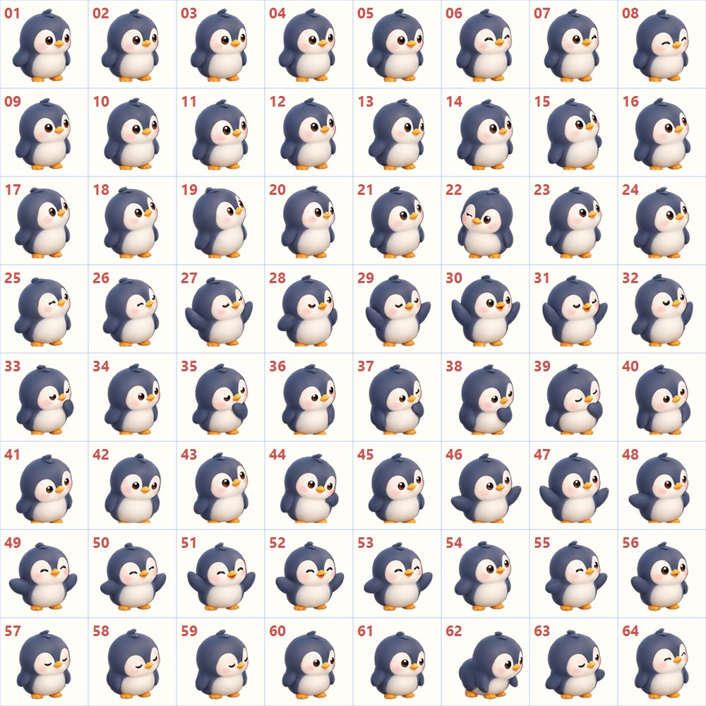
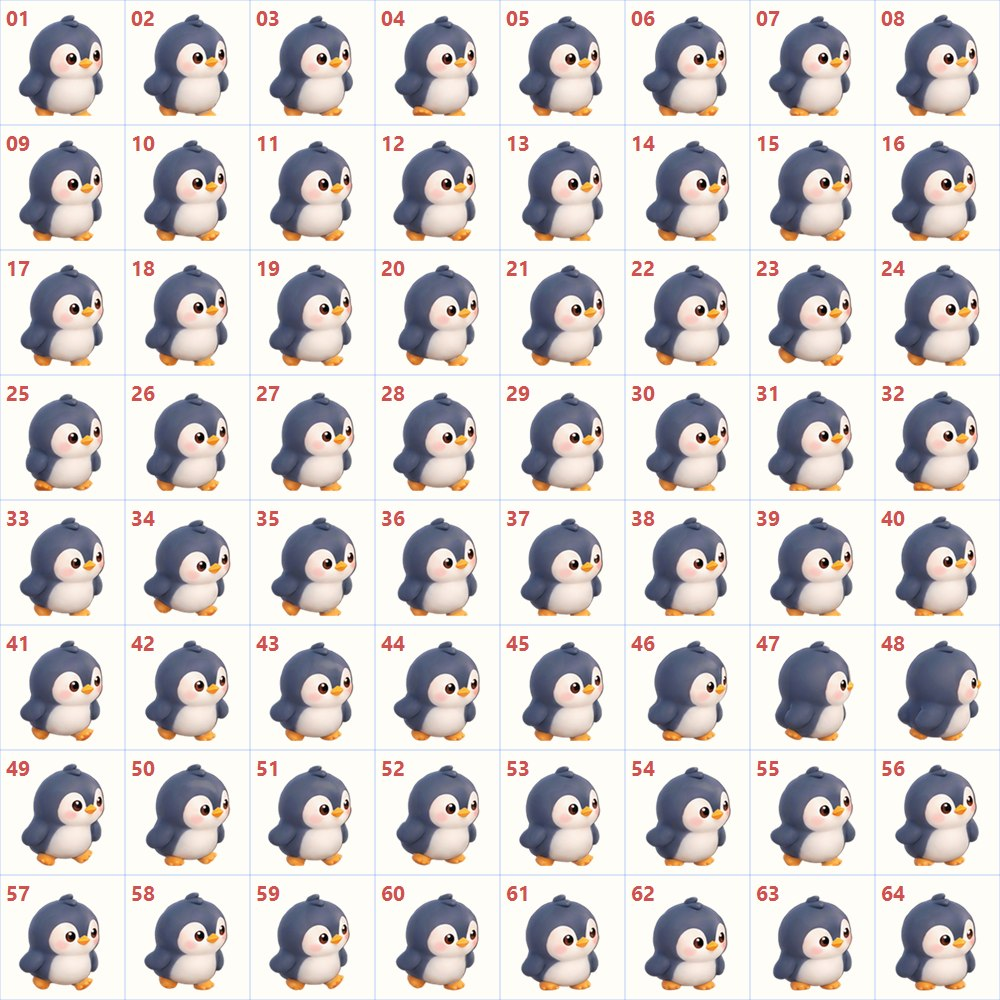
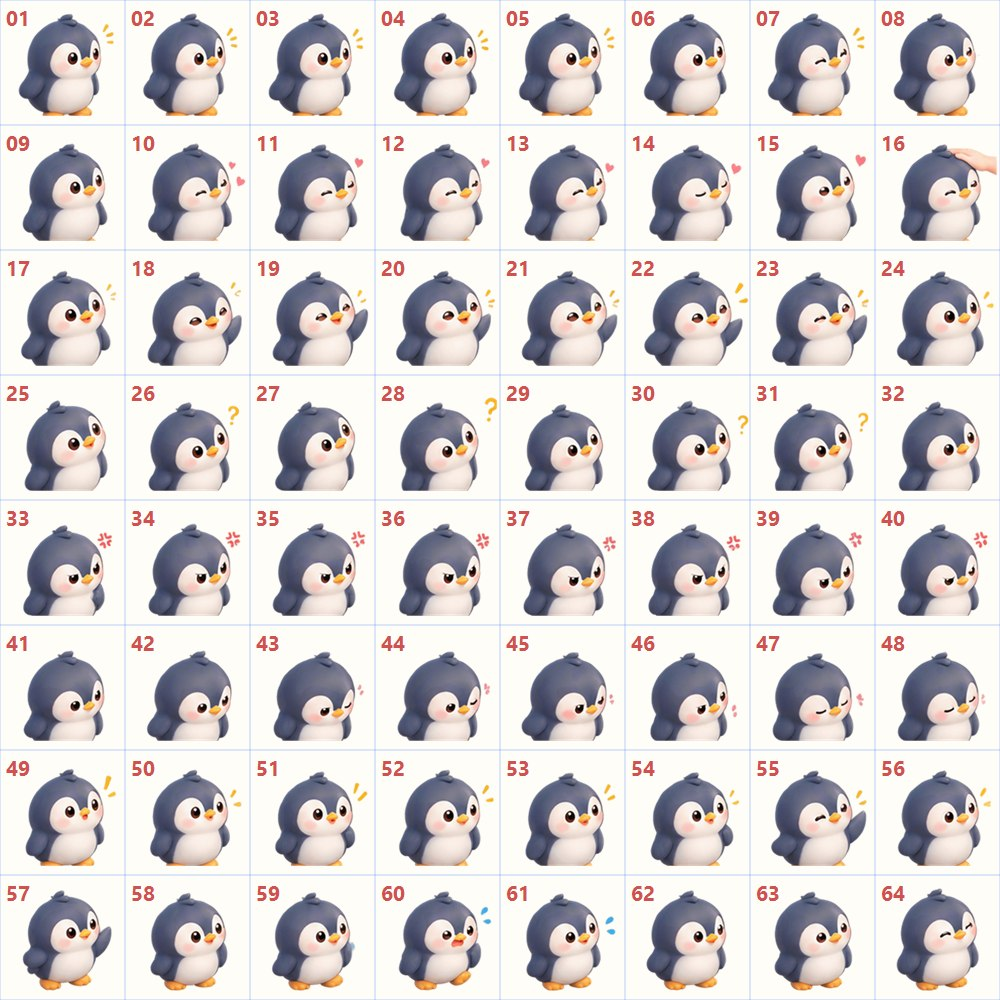
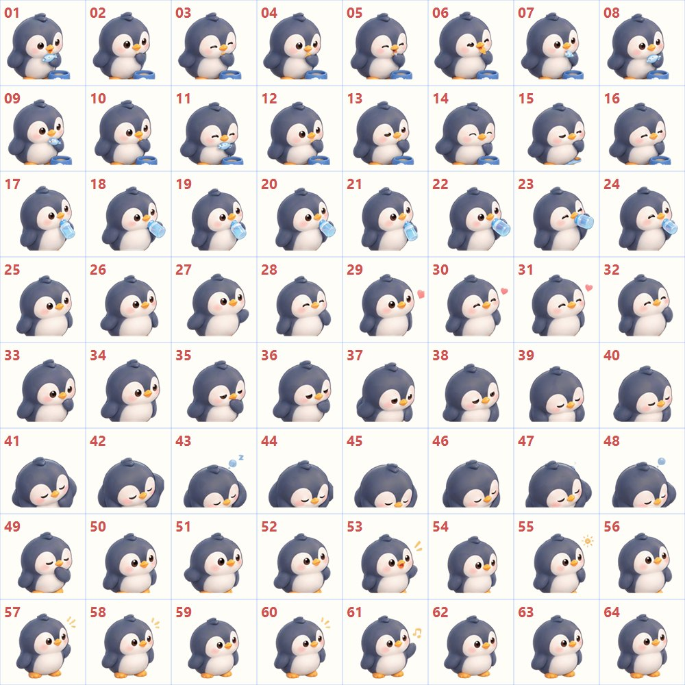
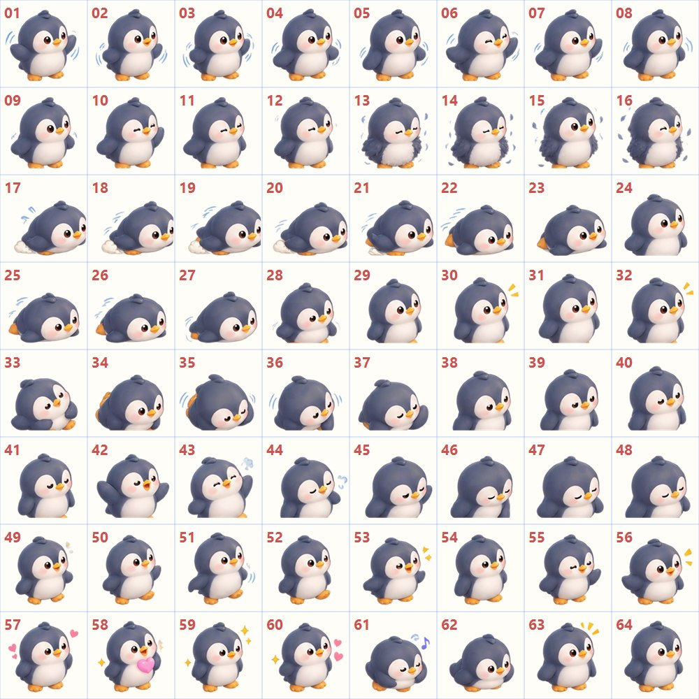

# 开发文档

## 1. 技术栈与环境

| 项 | 值 |
|---|---|
| 语言 | C# |
| 框架 | .NET 10（`net10.0-windows`） |
| UI | WPF（+ 少量 WinForms 仅用于托盘 `NotifyIcon`） |
| 存档 | `System.Text.Json` |
| 平台 | Windows 10 / 11（x64） |
| 依赖 | 无第三方库 |

构建 / 运行：

```bash
dotnet build
dotnet run
```

## 2. 项目结构

```
Core/        核心逻辑，不依赖任何 WPF 控件
  BehaviorState.cs   行为枚举
  Gait.cs            走动步态（普通 / 小步 / 小跑 / 快走）
  AnimationClips.cs  行为 / 步态 → 剪辑名映射 + 图集缺失回退链
  PetState.cs        养成数值与衰减 / 离线结算
  PetBehavior.cs     行为系统（加权随机 + 需求影响 + 休息冷却）
  PetController.cs   协调行为 / 状态 / 视图
  IPetView.cs        核心与 UI 的边界
  Food.cs            食物定义
  EffectKind.cs      粒子效果类型
  OutfitState.cs     装扮选择
  PetSession.cs      一次运行的会话数据
Animation/   精灵图集与动画播放
  SpriteSheet.cs     固定网格切分 + 帧缓存
  AnimationClip.cs   一段动画的播放定义
  AnimationLibrary.cs 读取 animations.json，按需加载图集
  PetAnimation.cs    由游戏循环驱动的时间轴播放器
UI/          窗口与主题
  Theme.xaml         暖色圆角主题（按钮 / 复选框 / 下拉 / 滑杆 / 进度条 / ToolTip）
  PetWindow.*        宠物窗口（透明 / 拖动 / 悬停 UI / 逐像素命中）
  PetMenuWindow.*    右侧弧形菜单（含食物子弧）
  StatusWindow.*     头顶迷你状态（图标 + 百分比，鼠标穿透）
  SettingsWindow.*   设置
  OutfitWindow.*     装扮
  ToastWindow.*      应用内通知（右下角轻提示，替代系统托盘气泡）
  EffectLayer.cs     独立粒子层
Platform/    平台能力
  AppInfo.cs         版本号 + GitHub 仓库配置
  UpdateService.cs   GitHub Releases 检查更新
  TrayManager.cs     系统托盘
  StartupManager.cs  开机启动（HKCU Run）
  SoundManager.cs    运行时合成音效
  WindowManager.cs   跨屏虚拟桌面边界 + DPI
  AppSettings.cs     程序配置
Save/        本地 JSON 存档
  PetSaveData.cs     存档结构 + 离线结算
  SaveManager.cs     读写
Assets/      图标与图集
  app.ico / app-icon.png
  Pet/Pet_Idle.png      企鹅待机图集（Idle / 眨眼 / 张望 / 理羽等）
  Pet/Pet_Move.png      企鹅移动图集（行走 / 小跑 / 转身 / 停下等）
  Pet/Pet_Action.png    企鹅互动图集（被点击 / 抚摸 / 开心 / 生气 / 害羞等）
  Pet/Pet_EatSleep.png  企鹅吃睡图集（吃东西 / 喝水 / 困倦 / 睡觉 / 睡醒等）
  Pet/Pet_Special.png   企鹅特殊图集（扑翅 / 抖羽毛 / 肚皮滑行 / 跌倒 / 蹦跳等）
  Pet/animations.json   动画表
installer/   Inno Setup 脚本
tools/       SpriteSlicer 切图工具
```

## 3. 架构与数据流

核心逻辑与 WPF UI 分离：`PetBehavior` / `PetController` 只通过 `IPetView` 驱动界面，不直接依赖控件。

```
PetController
  ├─ PetBehavior   （自主行为，纯逻辑）
  ├─ PetState      （数值）
  └─ IPetView ──► PetWindow（实现）──► PetAnimation ──► SpriteSheet
                                     └► EffectLayer（独立粒子层，与状态机解耦）
```

单一时钟：`PetWindow` 用一个 `DispatcherTimer`（约 60fps）驱动 `PetController.Tick(dt)` 与 `PetAnimation.Tick(dt)`，避免多 Timer 漂移。

## 4. 精灵图规范（重要）

### 4.1 画布与网格

| 项 | 标准值 |
|---|---|
| 图集尺寸 | 2048 × 2048 |
| 网格 | 8 × 8（共 64 格） |
| 单格 | 256 × 256 |
| 背景 | 真正透明（RGBA） |

- 每个格子是一帧，**角色不得跨越格子边界**。
- 不需要填满 64 格，空帧保持透明即可。
- 程序按 `像素宽 / 8` 动态计算格宽，所以其它尺寸也能读；但**标准一律用 2048**，避免混乱。

### 4.2 统一锚点

- 每格中，**双脚落地点中心**统一为 **(X = 128, Y = 236)**（格内像素坐标）。
- 站立 / 待机 / 行走等动作双脚都落在这个点附近。
- 程序放置窗口时，把该锚点对齐到桌面的宠物位置。

### 4.3 朝向

- 美术**只制作朝右方向**（3/4 正面朝右）。
- 朝左由程序水平镜像（`ScaleX = -1`），**不要画左右两套**。

### 4.4 透明背景清理

AI 生成的图常见两类问题，切图时必须清理：

1. **低 alpha 噪点**：背景残留 alpha 6~40 的杂点 → 将 `alpha < 40` 的像素置为全透明。
2. **网格辅助线**：AI 有时会画出淡淡的格线（alpha 40~80），会在每格四边留下边框线 → 在每个格子边界清除 8px 宽的 band。

### 4.5 锚点归一化（关键，防抖动）

AI 生成的每帧角色位置往往不一致，直接播放会左右滑动、忽大忽小。切图时对**每帧**做锚点归一化：

1. 计算该帧不透明像素的包围盒。
2. 取包围盒**底部 15% 区域的水平中心**作为脚部中心 X（比用整框中心更稳，避开尾巴摆动）。
3. 取包围盒底部作为 Y。
4. 平移整帧内容，使 `(脚部中心X, 底部Y)` → `(128, 236)`。

> 这一步会改变角色在格内的位置，但**不裁剪、不缩放**，仍是 256×256 的完整网格。

### 4.6 帧号与动画表

- 帧号 **1-based**，顺序为"从左到右、从上到下"：第 1 行 01~08，第 2 行 09~16……
- 播放顺序完全由 `Assets/Pet/animations.json` 指定，程序不自行判断。

```json
{
  "grid": { "columns": 8, "rows": 8, "cellWidth": 256, "cellHeight": 256, "anchorX": 128, "anchorY": 236 },
  "sheets": { "idle": "Pet_Idle.png", "move": "Pet_Move.png" },
  "animations": {
    "Idle": { "sheet": "idle", "frames": [1,2,3,4,5,6,9,10,11,12,13,14], "fps": 6, "loop": true }
  }
}
```

- `sheet`：`sheets` 里的键；图集文件放在 `Assets/Pet/`。
- `frames`：1-based 帧号数组。
- `fps`：帧率。
- `loop`：是否循环；不循环的短动作播完后由视图自动回到循环的 `Idle`（`PetWindow.UpdateOneShot`），不会停在最后一帧。

### 4.7 Pet_Idle 动作映射

图集：`Pet_Idle.png`；`animations.json` 中 `sheet` 为 `idle`。



| 格内动作 | 帧号 | 剪辑名 | 行为状态 | fps | 循环 |
|---|---|---|---|---|---|
| 待机 | 01-06, 09-14 | `Idle` | `Idle` | 6 | 是 |
| 眨眼 | 07-08 | `Blink` | （待机时叠加，见 7） | 6 | 否 |
| 东张西望 | 15-20 | `LookAround` | `LookAround` | 6 | 否 |
| 伸懒腰 | 21-26 | `Stretch` | `Stretch` | 5 | 否 |
| 整理羽毛 | 27-32 | `Groom` | `Groom` | 5 | 否 |
| 好奇待机 | 33-38 | `Curious` | `Curious` | 5 | 否 |
| 小翅膀动作 | 39-44 | `Tail` | `Tail` | 6 | 否 |
| 轻微开心 | 45-48 | `Happy` | `Happy` | 5 | 否 |
| 发呆 | 49-54 | `Doze` | `Sit` | 4 | 是 |
| 小动作 | 55-60 | `Fidget` | `Fidget` | 5 | 否 |
| 特殊待机 | 61-64 | `Special` | `Special` | 5 | 否 |

### 4.8 Pet_Move 动作映射

图集：`Pet_Move.png`；`animations.json` 中 `sheet` 为 `move`。



| 格内动作 | 帧号 | 剪辑名 | 行为状态 / 步态 | fps | 循环 |
|---|---|---|---|---|---|
| 行走 01-16 | 01-16 | `Walk` | `Walk` / `Gait.Walk` | 12 | 是 |
| 小步快走 | 17-24 | `WalkSmall` | `Gait.Small` | 12 | 是 |
| 快速移动 | 25-32 | `MoveFast` | `Gait.Fast` | 14 | 是 |
| 减速 | 33-36 | `SlowDown` | （备用） | 10 | 否 |
| 停止 | 37-40 | `Stop` | （备用） | 10 | 否 |
| 转身 | 41-48 | `Turn` | `Turn` | 10 | 否 |
| 回头移动 | 49-54 | `MoveBack` | （备用） | 10 | 是 |
| 小跑 | 55-60 | `Trot` | `Gait.Trot` | 12 | 是 |
| 移动后停下 | 61-64 | `StopAfterMove` | `Stop` | 10 | 否 |

> 剪辑名 ↔ 行为/步态的映射集中在 `Core/AnimationClips.cs`，改动那里即可，不必改行为逻辑。

### 4.9 Pet_Action 动作映射

图集：`Pet_Action.png`；`animations.json` 中 `sheet` 为 `action`。



| 格内动作 | 帧号 | 剪辑名 | 行为状态 / 触发 | fps | 循环 |
|---|---|---|---|---|---|
| 被点击 | 01-08 | `Clicked` | `Clicked`（点击宠物） | 10 | 否 |
| 被抚摸 | 09-16 | `Petted` | `Interact`（抚摸） | 10 | 否 |
| 开心 | 17-24 | `Happy` | `Happy`（喂食 / 抚摸后） | 10 | 否 |
| 好奇 | 25-32 | `Curious` | `Curious`（自主 / 互动） | 10 | 否 |
| 生气 | 33-40 | `Angry` | `Angry`（饥饿 > 75 时抚摸） | 10 | 否 |
| 害羞 | 41-48 | `Shy` | `Shy`（抚摸后随机） | 10 | 否 |
| 惊讶 | 49-54 | `Surprised` | `Surprised`（睡着/坐着时被点击） | 10 | 否 |
| 打招呼 | 55-58 | `Wave` | `Wave`（启动时） | 8 | 否 |
| 受到惊吓 | 59-62 | `Startled` | `Startled`（拖动拎起） | 12 | 否 |
| 互动结束 | 63-64 | `InteractEnd` | `InteractEnd`（互动收尾） | 6 | 否 |

> 互动由 `PetController` 的**状态队列**驱动，例如抚摸 = `Interact` → `Happy`/`Shy` → `InteractEnd` → 回到自主行为。

### 4.10 Pet_EatSleep 动作映射

图集：`Pet_EatSleep.png`；`animations.json` 中 `sheet` 为 `eatSleep`。



| 格内动作 | 帧号 | 剪辑名 | 行为状态 / 触发 | fps | 循环 |
|---|---|---|---|---|---|
| 吃东西 | 01-16 | `Eat` | `Eat`（喂食小鱼干 / 鲜虾） | 10 | 是 |
| 喝水 | 17-28 | `Drink` | `Drink`（喂牛奶） | 10 | 是 |
| 吃饱开心 | 29-32 | `EatHappy` | `EatHappy`（吃完 / 已饱） | 8 | 否 |
| 困倦 | 33-40 | `Sleepy` | `Sleepy`（准备睡觉） | 6 | 否 |
| 睡觉 | 41-54 | `Sleep` | `Sleep`（精力低时自主） | 6 | 是 |
| 睡醒 | 55-62 | `WakeUp` | `WakeUp`（睡醒过渡） | 8 | 否 |
| 清醒待机 | 63-64 | `AwakeIdle` | `AwakeIdle`（刚醒的待机） | 6 | 是 |

> 睡觉是行为系统里的一串过渡：`Sleepy` → `Sleep` → `WakeUp` → `AwakeIdle` → `Idle`；`Sleeping` 仅在 `Sleep` 期间为真（影响精力恢复）。

### 4.11 Pet_Special 动作映射

图集：`Pet_Special.png`；`animations.json` 中 `sheet` 为 `special`。



| 格内动作 | 帧号 | 剪辑名 | 行为状态 / 触发 | fps | 循环 |
|---|---|---|---|---|---|
| 扑翅 | 01-12 | `Flap` | `Special`（随机） | 10 | 否 |
| 抖羽毛 | 13-20 | `Shake` | `Special` | 10 | 否 |
| 肚皮滑行 | 21-28 | `BellySlide` | `Special` | 12 | 否 |
| 滑行停止 | 29-32 | `SlideStop` | `Special` | 10 | 否 |
| 跌倒 | 33-36 | `Fall` | `Special` | 10 | 否 |
| 爬起 | 37-40 | `GetUp` | `Special` | 10 | 否 |
| 伸展 | 41-48 | `StretchLong` | `Special` | 6 | 否 |
| 蹦跳 | 49-56 | `Hop` | `Special` | 12 | 否 |
| 特殊开心 | 57-60 | `SpecialHappy` | `Special` | 8 | 否 |
| 特殊动作 | 61-64 | `SpecialAction` | `Special` | 8 | 否 |

> `PetBehavior` 选中 `Special` 时随机挑一个 `SpecialKind`（`Core/SpecialKind.cs`），再由 `AnimationClips.ForSpecial` 映射到剪辑；状态时长与剪辑长度对齐。

后续图集（`Pet_Outfit` / `Pet_Effect`）同规格，只需在 `animations.json` 增加对应 `sheet` 与动画即可；缺失的图集程序会沿 `AnimationClips.Chain` **逐级回退到 Idle**，不会切回占位形象。

## 5. 切图工具 SpriteSlicer

位于 `tools/SpriteSlicer/`，五种模式：

```bash
# 1) 切图：输入 → 处理后图集 + 64 帧 + 预览
dotnet run --project tools/SpriteSlicer -- <input.png> Assets/Pet/Pet_Idle.png <framesDir>

# 2) 测量：打印每格包围盒（脚底Y / 水平中心 / 宽高），用于验证对齐
dotnet run --project tools/SpriteSlicer -- measure Assets/Pet/Pet_Idle.png

# 3) 生成图标：多尺寸 .ico
dotnet run --project tools/SpriteSlicer -- makeico Assets/app-icon.png Assets/app.ico

# 4) 清理顶部杂块：就地修复已有图集
dotnet run --project tools/SpriteSlicer -- cleanup Assets/Pet/Pet_Action.png

# 5) 按图集统一缩放：以脚部锚点为中心，对齐不同图集之间的角色大小
dotnet run --project tools/SpriteSlicer -- scale Assets/Pet/Pet_EatSleep.png 0.9313
```

切图流程（`NormalizeAnchors` 等）依次执行：**缩放到 2048×2048 → 清理低 alpha 噪点 → 清除格边界线 → 清理顶部杂块 → 锚点归一化 → 保存图集 → 导出 64 帧 + 预览**。

- **清理顶部杂块 `RemoveTopStray`**：AI 原图常把上一行角色的脚 / 边角压进下一行格子里，播放时会在头顶露出半截"脚"。该步骤按连通块处理，只删除「不是主体、且触及顶部 16px」的碎块，保留爱心 / 问号 / `Zzz` 等悬浮元素。
- 已有图集可用 `dotnet run --project tools/SpriteSlicer -- cleanup Assets/Pet/<名称>.png` 就地修复。
- **按图集统一缩放 `scale`**：AI 生成的不同图集常**整体大小不一**，切换图集（待机 ↔ 喂食 ↔ 互动）时角色会"放大 / 缩小"。用 `scale <atlas> <factor>` 以脚部锚点为中心整体缩放对齐：
  - 量法：每格取「主体包围盒上 35% 区域的最大横向跨度」近似**头部宽度**，再取 64 帧中位数（对姿势不敏感）。
  - 以 `Pet_Idle`（中位数 ≈149px）为基准，当前系数：`Pet_Move ×0.974`、`Pet_Action ×0.993`、`Pet_EatSleep ×0.931`、`Pet_Special ×0.974`。
  - 新图集切完后先量一次、再按需 `scale`，避免和已有图集对不上。

### 5.1 图片尺寸不一样怎么办（重点）

- **输入是任意正方形都能用**：工具会先 `HighQualityBicubic` 缩放到 2048×2048，再按 8×8 切。
  - 例：微信压缩后的 1254×1254 也能处理（先放大回 2048，再切）。
- **必须是 8×8 网格**。如果你的图是别的网格（例如 6×6），改 `tools/SpriteSlicer/Program.cs` 顶部常量：

  ```csharp
  const int Grid = 8;   // 改成你的网格数
  const int Cell = 256;
  const int Size = 2048;
  ```

- **输入必须接近正方形**：非正方形会被拉伸变形，请重新生成正方形图。
- **最佳做法**：直接生成 **2048×2048** 原图，并且**不要用微信等聊天软件传输**（会压缩 / 降分辨率 / 破坏透明通道），用文件方式或网盘传原图。

### 5.2 新增一张图集的步骤

1. 按 4.1~4.3 的规格生成 2048×2048、8×8、朝右、透明背景的 Sprite Sheet。
2. 用 SpriteSlicer 切图，输出到 `Assets/Pet/<名称>.png`；用 `measure` 确认每帧脚底 Y 一致。
3. 在 `Assets/Pet/animations.json` 的 `sheets` 增加键，在 `animations` 增加对应动画（帧号按图内容）。
4. 若该动作对应某个行为状态，在 `Core/AnimationClips.cs` 的 `ForState` 里映射。
5. 运行验证。

## 6. 状态系统

| 数值 | 变化规则 |
|---|---|
| 饥饿 | `+4/小时`；喂食降低 |
| 心情 | 抚摸 / 喂食提升；饥饿 > 70 时 `-1.2/小时` |
| 精力 | 醒着 `-3/小时`；睡觉 `+18/小时` |
| 健康 | 饥饿 > 90 或精力 < 5 时 `-1.5/小时`，否则 `+1/小时`；下限 20，**永不死亡** |

- 界面显示的是**饱食度 = 100 − 饥饿**（喂食往上涨，100% 表示吃饱）。
- 离线结算 `ApplyOffline`：按经过时间计算，封顶 72 小时，假设离线期间多在休息。

## 7. 行为系统

`PetBehavior` 每个 tick 用**加权随机 + 需求影响**挑选行为，而非固定时间轴：

- 精力越低 → 越可能睡觉、坐下
- 精力越高（alertness）→ 越可能出现张望 / 好奇 / 扇翅 / 理羽 / 小动作 / 伸懒腰 / 特殊待机
- 走动有 **10~24 秒冷却**，单次距离 60~240px，走完安静待机数秒（避免一直来回走）
- 走动带**步态**（`Gait`）：普通 / 小步快走 / 小跑 / 快速移动，按距离与随机选择，速度随之变化
- 方向与当前朝向相反时，先进入 `Turn`（转身）再走；到达目标后进入 `Stop`（停下）再回待机
- 每个主动动作（走动 / 张望 / 理羽等）结束后先回待机并进入 **2~5 秒休息冷却**，冷却期间几乎只待机/坐着，避免动作一个接一个连播
- 睡觉是一串过渡：`Sleepy`（困倦）→ `Sleep`（睡觉）→ `WakeUp`（睡醒）→ `AwakeIdle`（清醒待机）→ `Idle`
- 待机小动作（张望 / 理羽等）播完后由视图自动回到循环的 `Idle`（`PetWindow.UpdateOneShot`），不会停在最后一帧像"卡住"；互动 / 吃睡剪辑由控制器接管，不自动回退
- 互动时用 `OverrideState` 强制进入吃东西 / 被摸等状态，结束后回到自主行为
- 悬停菜单打开时 `Autonomous = false`，暂停自主走动但互动照常进行
- 待机时视图层会不定时播放 `Blink`（眨眼），见 `PetWindow.UpdateBlink`

### 7.1 行为 / 步态 → 剪辑映射

映射集中在 `Core/AnimationClips.cs`，剪辑名与 `animations.json` 对应：

| 行为 / 步态 | 剪辑 | 所属图集 |
|---|---|---|
| Idle | Idle | idle |
| Walk / Gait.Small / Gait.Trot / Gait.Fast | Walk / WalkSmall / Trot / MoveFast | move |
| Turn | Turn | move |
| Stop | StopAfterMove | move |
| LookAround / Stretch / Groom / Tail / Fidget | 同名剪辑 | idle |
| Sit | Doze | idle |
| Happy / Curious / Angry | 同名剪辑 | action |
| Interact / Clicked / Shy / Surprised / Wave / Startled / InteractEnd | Petted / Clicked / Shy / Surprised / Wave / Startled / InteractEnd | action |
| Eat / Drink / EatHappy / Sleepy / Sleep / WakeUp / AwakeIdle | 同名剪辑 | eatSleep |
| Special | 随机 `SpecialKind` → Flap / Shake / … | special |

`AnimationClips.Chain` 定义图集缺失时的回退：走动类 → `Walk` → `Idle`；`Sleep` → `Doze` → `Idle`；其余 → `Idle`。因此**新图集只要补进 `animations.json` 即可生效，代码无需改动**。

## 8. 存档

- 位置：`%AppData%\DesktopPet\save.json`
- 内容：名称、位置、四项数值、装扮、程序设置、最后保存时间
- 时机：状态变更、拖动结束、每分钟自动保存、退出时
- 启动时读取并做离线结算

## 9. 版本与更新

- 版本号在 `DesktopPet.csproj` 的 `<Version>`（当前 `1.1.1`），运行时由 `Platform/AppInfo.cs` 读取。
- CI 发布时会用 git tag（去掉 `v`）覆盖版本号。
- 检查更新由 `Platform/UpdateService.cs` 完成：访问 GitHub 网页的 `releases/latest`，
  读取 302 跳转地址里的 tag（**不用 REST API**，避免未登录 60 次/小时的限流导致 403 静默失败）。
  - 仓库地址在 `Platform/AppInfo.cs`（当前 `lyhxx/pet-desktop`），留空则跳过检查。
  - 启动后延迟 6 秒自动检查；也可在托盘菜单手动检查。
  - 结果分三种：有新版 / 已是最新 / 检查失败（失败会在手动检查时明确提示，而不是假装最新）。
  - 通知走应用内轻提示 `UI/ToastWindow`（右下角堆叠、几秒淡出），发现新版本时点击打开 Release 页。

## 10. 构建与发布

```bash
# 自包含发布
dotnet publish DesktopPet.csproj -c Release -r win-x64 --self-contained true -o publish
```

GitHub Actions：

- `.github/workflows/build.yml`：push / PR 自动编译
- `.github/workflows/release.yml`：打 `v*` tag 时自动发布绿色版 zip + Inno Setup 安装包

安装包脚本 `installer/DesktopPet.iss`，版本号可由 CI 通过 `/DMyAppVersion=` 注入。
